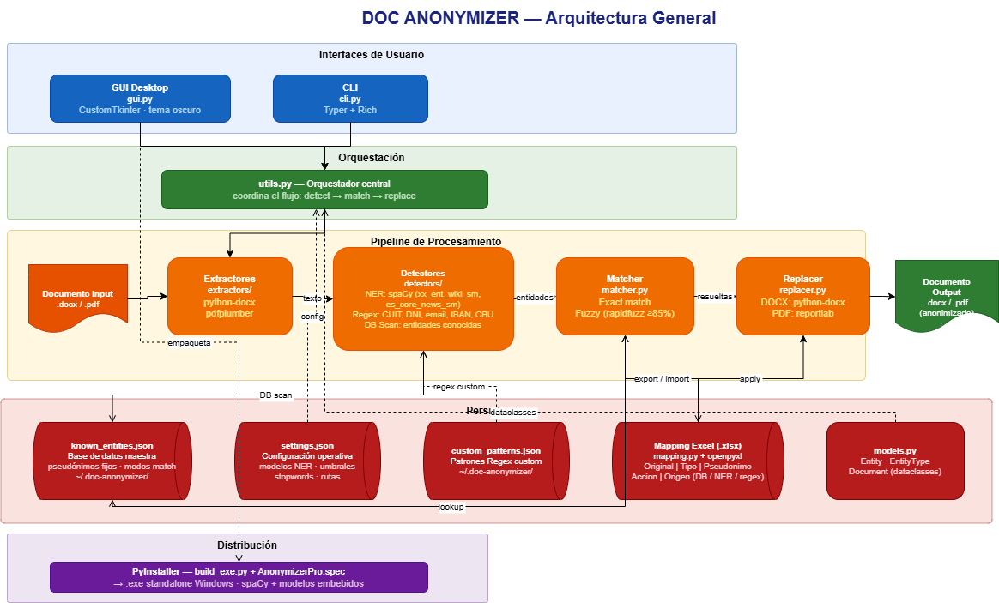

# 
 Anonimizador de Documentos 🕵️‍♂️

###  "Para que la IA te ayude, pero no se entere de todo."

Esta es una aplicación sencilla para anonimizar documentos (Word y PDF) de manera **completamente offline**. Ideal para cuando querés pasarle un texto a un LLM (como ChatGPT o Claude) pero necesitás que los nombres reales, empresas y datos sensibles se queden en tu casa.
**bastante probada en word, poco en pdf y además en pdf no te respeta el formato** --comming soon--

---

## ⚠️ Disclaimer Hobbyista
Esta es una app **hobbyista**, hecha por pura diversión y necesidad personal.
100% vibe coding (una maravilla) 
*   **Soporte:** Cero.
*   **Mantenimiento:** Si tengo ganas y tiempo. 
*   **Garantía:** Si se rompe, te quedás con los pedacitos. 
**Si sirve vemos como seguimos".**

---

## 🚀 El flujo (es una pavada)
Esta pensada para "usuario experto" o por lo menos que sepas algo de excel.
El flujo de trabajo con la UI es así:

1.  **Elegís el archivo:** Seleccionás el Word o PDF original.
2.  **Detectar:** El programa usa IA local (Spacy) y patrones (Regex) para buscar nombres, organizaciones, montos, etc.
3.  **Ajustás el Excel:** Se te abre un Excel al lado de tu archivo. Ahí revisás qué detectó, le cambiás el pseudónimo si querés (ej: `Persona1` -> `El_Capo`) y marcás cuál querés reemplazar. 
    *   *Tip:* Podés marcar la 's' en "Guardar DB" para que el programa se acuerde de ese nombre para siempre.
4.  **Generar:** Cerrás el Excel, volvés a la app y le das al botón verde. ¡Listo! Tenés tu archivo anonimizado y el archivo de reversión.

---

## 🏗️ La Arquitectura
Para que no sea un spaghetti code, la cosa está organizada así:

*   **Detección:** Mezcla de NLP (Spacy) con RegEx para las cosas que la IA no pesca.
*     podes agregar tus propias Regex, busca el botón. Preguntale a tu chat amigo como escribir esa Regex que necesitas
*   **Memoria:** Un Excel al que tenes acceso, te podes hacer una auto-lobotomia si lo borrás.
*   **Reemplazo:** Un motor que respeta el formato del documento original solo en word por ahora.

---

## 🛠️ Cómo lo corro (si sos dev)
Si tenés Python en tu máquina:

1.  Clonás esto.
2.  Instalá las dependencias: `pip install -r requirements.txt`
3.  Bajás el modelo de lenguaje: `python -m spacy download es_core_news_lg`
4.  Ejecutás el comando: `python -m anonymizer.gui.main`

---

## 📄 Licencia
Hacé lo que quieras con el código. Si te hacés millonario, invitate un café.
